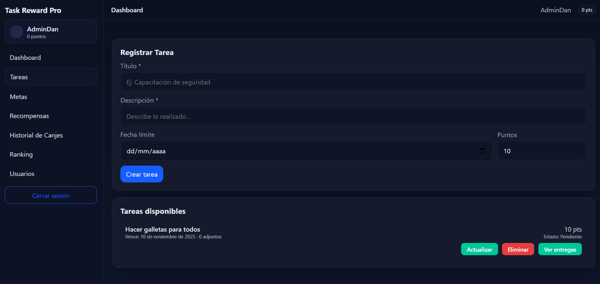
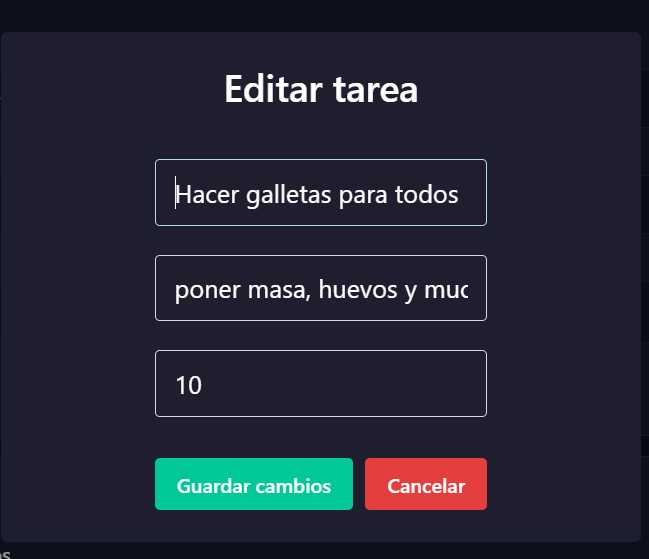
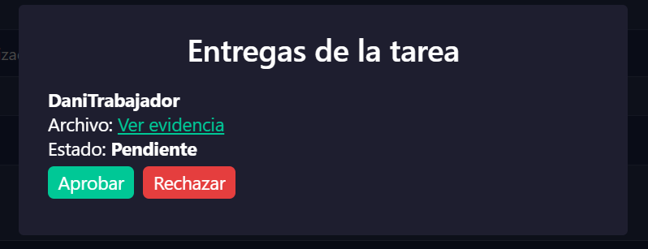
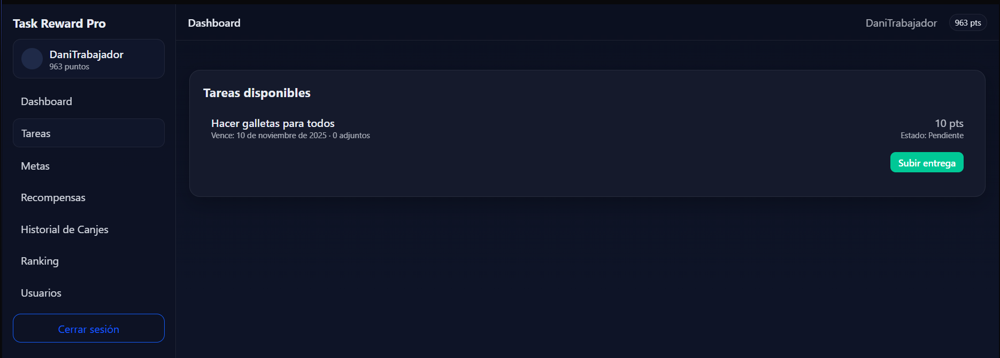
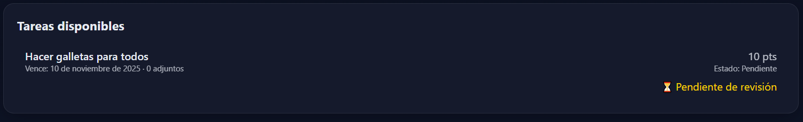
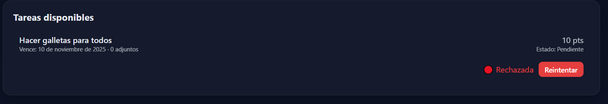
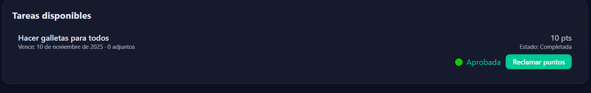

# TaskRewardPro
A simple reward and task management system for small companies and teams.

## About the Project
TaskRewardPro helps teams stay motivated. Workers finish tasks and receive **points**.  
Points can be **exchanged for rewards** configured by an administrator.  
The system also supports **goals**, **rankings**, and **role-based access**.

> Goal: make teamwork more dynamic and recognize individual effort.

---

# How our project looks

## Our logo


## For the Administrator or manager



## if the administrator wants to modify the task



## if you want to approve or reject the task uploaded by the worker




## For the worker



## when a task is pending review



## if the task is rejected



## if the assignment is approved and ready to claim the points



## Structure

```
TaskRewardPro/
├── Back/                       # Node.js + Express API
│   ├── node_modules/
│   ├── src/
│   │   ├── config/             # db connection
│   │   │   └── db.js
│   │   ├── controllers/        # request handlers
│   │   │   ├── authController.js
│   │   │   ├── historialCanjeController.js
│   │   │   ├── metaController.js
│   │   │   ├── rankingController.js
│   │   │   ├── recompensaController.js
│   │   │   ├── submissionController.js
│   │   │   ├── tareaController.js
│   │   │   └── usuarioController.js
│   │   ├── middleware/
│   │   │   ├── auth.js         # auth/JWT guard
│   │   │   ├── rolmiddleware.js# role-based guard
│   │   │   └── upload.js       # file upload helper
│   │   ├── models/             # domain models
│   │   │   ├── admin.js
│   │   │   ├── historialCanje.js
│   │   │   ├── meta.js
│   │   │   ├── ranking.js
│   │   │   ├── recompensa.js
│   │   │   ├── submission.js
│   │   │   ├── tarea.js
│   │   │   ├── trabajador.js
│   │   │   └── usuario.js
│   │   └── routes/             # API routes
│   │       ├── authRoutes.js
│   │       ├── historialCanjeRoutes.js
│   │       ├── metaRoutes.js
│   │       ├── rankingRoutes.js
│   │       ├── recompensaRoutes.js
│   │       ├── tareaRoutes.js
│   │       ├── usuarioRoutes.js
│   │       └── index.js        # mounts route modules
│   ├── .env
│   ├── package.json
│   └── index.js                # server entry
│
└── Front/                      # React + Vite web app
    ├── node_modules/
    ├── public/
    ├── src/
    │   ├── components/
    │   ├── context/
    │   ├── pages/
    │   ├── services/           # API calls
    │   ├── App.jsx
    │   ├── main.jsx
    │   └── styles.css
    ├── .env
    ├── index.html
    ├── package.json
    └── vite.config.js

## Main Features

1. **Task Management** – Admins create/assign tasks to workers or teams.  
2. **Reward System** – Workers exchange points for rewards.  
3. **Goals (SMART)** – Leaders define goals and track progress.  
4. **Performance Ranking** – Leaderboards by points and completed tasks.  
5. **Roles & Permissions** – Admin, Leader, Worker (middleware guards).  
6. **Submissions & Validation** – Workers submit evidence; leaders validate.

##  Current Project Status

> The project is still in development. Some features are working and others are in progress.

 **Currently Working:**  

- Create and assign tasks  
- Complete tasks and update their status  
- Redeem points for rewards  
- Create users and roles (Admin, Leader, Worker)  
- Database correctly updates user, task, and reward information  
- Authentication
- File uploads for task evidence  

 **Still in Progress:**  
 
- Ranking and goal modules  
- UI design improvements and dashboard  
- Email notifications and analytics  


## Tech Stack

| Layer     | Tools |
|-----------|------|
| Frontend  | React, Vite |
| Backend   | Node.js, Express |
| Database  | MongoDB (via Mongoose) |
| Auth      | JWT (middleware `auth.js`) |
| Styling   | (Your choice; Tailwind or CSS modules recommended) |


## Setup & Run (Development)

### 1 Backend (API)
```bash
cd Back
npm install
```

Create a `.env` file in `Back/`:

PORT=4000
MONGO_URI=mongodb://localhost:27017/taskrewardpro
JWT_SECRET=change_this_secret
# Optional:
# UPLOAD_DIR=./uploads
# CORS_ORIGIN=http://localhost:5173
```

Run the server:
```bash
npm run dev   # if you use nodemon
# or
node index.js
```

The API will run on: `http://localhost:4000` (or the port you set).

### 2 Frontend (Web App)
```bash
cd Front
npm install
```

Create a `.env` file in `Front/` (Vite uses `VITE_` prefix):
```
VITE_API_BASE=http://localhost:4000
```

Run the app:
```bash
npm run dev
```

The web app will run on Vite default: `http://localhost:5173`.


##  Domain Model
- **User** (Admin, Leader, Worker): profile, role, points, history.  
- **Task**: title, description, points, assignee, status, deadline.  
- **Submission**: evidence of completion for a task.  
- **Reward**: name, cost (points), stock/availability.  
- **Goal**: SMART target with progress tracking.  
- **Redeem History**: log of exchanges (points → rewards).  
- **Ranking**: computed view of performance.


##  Objectives
- Increase **productivity** and team **participation**.  
- Promote a culture of **recognition** and **transparency**.  
- Keep the UX simple for non-technical teams.


##  Scripts (suggested)
In `Back/package.json`:
```json
{
  "scripts": {
    "dev": "nodemon index.js",
    "start": "node index.js"
  }
}
```

In `Front/package.json`:
```json
{
  "scripts": {
    "dev": "vite",
    "build": "vite build",
    "preview": "vite preview"
  }
}
```
## Possible errors

- Dependency error --> This can be fixed by installing the necessary dependencies with the command *npm install “dependency name”*.
---

## Roadmap
- Email/notification on task validation.  
- Better dashboard analytics.  
- Admin UI for role & permission management.  
- File storage service for uploads.

---

## Team
**Juan Felipe Hincapié Machado**, **Daniel Alberto Ospina Zarza**, **Sebastián Quiceno Muñoz**, **Juan Sebastián Pérez Moncada**

---

